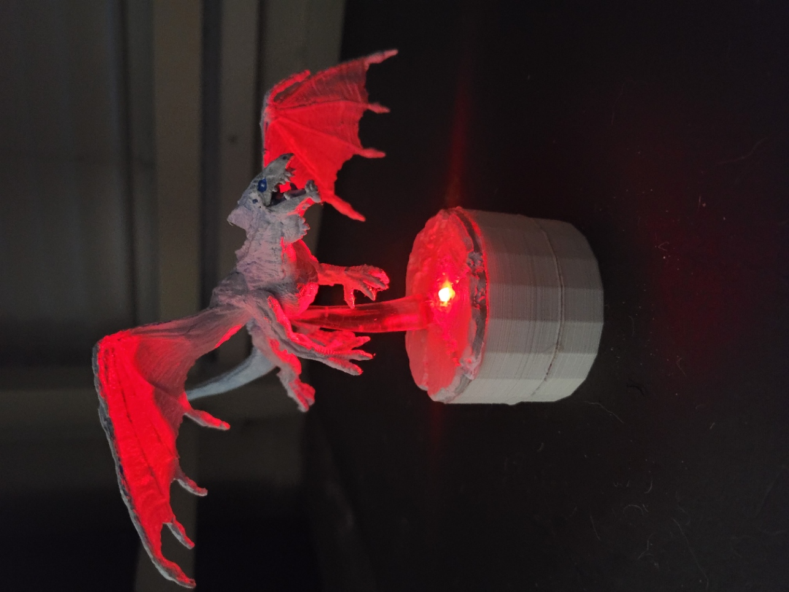

# DragonBoi
D&amp;D figurine light stand

Enjoy Justin!

  

<a href="https://www.tinkercad.com/things/7relOf7Lwub">3D Files</a> (Note: Need to chamfer edges around battery hatch to prevent binding and should reduce button hole size)

<a href="https://www.sparkfun.com/products/13342">Lilypad Arduino</a>

<a href="https://www.sparkfun.com/products/13883">Lilypad Battery</a>

<a href="https://www.sparkfun.com/products/13735">Lilypad LED</a>

<a href="https://www.amazon.com/HiLetgo-FT232RL-Converter-Adapter-Breakout/dp/B00IJXZQ7C/ref=sr_1_5?crid=F8XMG26UCCLX&keywords=ftdi+round+pins&qid=1673911868&sprefix=ftdi+round+pins%2Caps%2C88&sr=8-5">FTDI Programmer (For updating software)</a>
